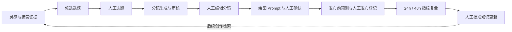

# Bubu ContentOps Agent

面向微信公众号条漫创作的 AI 内容工作台，把**运营证据、选题、分镜、绘图 Prompt、发布登记与数据复盘**连接为一条可追溯、可人工干预的工作流。

项目来自个人公众号内容运营场景：历史阅读数据在 Excel/CSV，创作经验在周复盘和文章记录中，选题与视觉设计又需要多轮修改。Bubu 将这些分散环节放进同一作品上下文，让模型提供建议，让创作者保留决定权。

`LangGraph` · `FastAPI` · `React / TypeScript` · `PostgreSQL / pgvector` · `Redis / ARQ` · `MCP`

[完整业务图集](docs/business-workflow.md) · [系统架构](docs/architecture.md) · [代码导览](docs/learning-guide.md)

## 从一个灵感开始

输入“一碗面里的爱”，系统结合历史运营资料生成三个不同叙事方向。创作者可以比较冲突、机制和读者价值，选择、重做或输入自己的选题；右侧保留检索证据，方便核对建议的依据。

*实际运行截图。候选卡上的潜力、重复风险是模型辅助判断，不是经过校准的成功概率。*

## 解决什么业务问题

| 内容运营中的问题 | 工作台中的处理方式 |
| --- | --- |
| 历史经验分散，选题时反复翻资料 | 检索周复盘、单篇记录和长期打法，并把引用带到工作台 |
| 分镜交给视觉环节时，角色、时间和道具容易偏移 | 用结构化分镜和交接卡传递约束，允许逐格编辑与局部重生成 |
| 修改后难以追溯用了哪版提示词、改过什么 | 保存产物版本、Skill 版本、Prompt hash、模型调用记录和 checkpoint |
| 发布后的数据与创作判断脱节 | 登记发布，匹配 24h/48h 指标，生成复盘及知识更新提案 |
| 模型结论不宜直接改写运营资料 | 人工审批后，由确定性服务执行限定路径的 Markdown 写回 |

## 一篇内容如何流转

### 1. 把叙事变成可编辑的分镜

不仅生成一段故事，还拆出每格的场景、动作、情绪、镜头、对白与时间。交接卡集中记录环境、固定道具和情绪高点，创作者修改后再交给视觉环节。右侧证据始终可见。

### 2. 把分镜转成可交付的绘图 Prompt

输出封面和逐格英文 Prompt，附带负面约束与连续性说明，支持复制和单格重生成。创作者确认后，交给外部绘图工具完成图片制作；本项目不直接生成图片。

*该截图来自保留的 v1.0.0 历史运行，用于展示交付结构；角色、文字和画风约束以该次运行版本为准。[版本与校验边界](docs/visual-prompt-v1.1.md)。*

### 3. 用运营数据检验创作判断

数据中心汇总作品阅读表现、互动指标、历史基线及采集状态。发布登记后，Worker 从已有运营数据源同步指标，在达到 24h/48h 里程碑时恢复复盘流程；知识提案经人工批准后才能写回。

*图中数字是截图时的运营数据快照，不是 Agent 带来的增量收益，也不是系统性能评测结果。公众号数据采集由既有运营系统负责，本项目通过 MCP 只读接入。*

## 关键工程设计

| 设计 | 为什么这样做 | 代码入口 |
| --- | --- | --- |
| LangGraph 主图与子流程 | 显式管理生成、审批、返工、等待指标和复盘，支持暂停与恢复 | [main_graph.py](backend/app/graphs/main_graph.py) |
| 按职责拆分 Agent | Strategy / Storyboard / Visual / Reviewer / Retro 分别承担选题、分镜、视觉、审核和复盘；路由不交给模型决定 | [agents/](backend/app/agents/) |
| 版本化 Skill | 在运行中冻结版本计划，记录 Prompt hash，让历史结果可追溯 | [registry.py](backend/app/skills/registry.py) |
| RAG 与精确数据分离 | 文本经验走 pgvector + 应用层词法匹配；阅读量等数字走 MCP 精确查询 | [hybrid.py](backend/app/rag/hybrid.py)、[metrics.py](backend/app/domain/metrics.py) |
| 结构化输出与有限重试 | Pydantic 校验输出，记录 Schema 修复与错误，避免无限重试 | [llm.py](backend/app/integrations/llm.py) |
| 受控工具写回 | 人工审批、后端批准令牌、路径白名单和幂等记录共同限制写操作 | [writeback.py](backend/app/domain/writeback.py)、[MCP Adapter](mcp_server/app/adapters/wechat_workspace.py) |

### 看得见每一次模型调用

调用记录按作品汇总模型请求，可查看节点、Skill 版本、完整消息、输入、原始输出、Schema 解析结果、耗时及可用的 Token 用量。遇到异常时，可以定位到具体调用，而不是只看到最终文案。

*升级记录功能前产生的旧调用标为“历史记录”，可能没有完整消息或 Token 用量；页面累计值不等同于完整历史成本。*

查看 Checkpoint 历史与分支：保留原路线，尝试另一种创作方向

从历史 checkpoint 创建新 thread，继承当时的业务状态和 Skill 版本计划，继续后续流程。原 thread 的 checkpoint 不被覆盖；作品的当前活动路线切换到新分支。

## 实现范围

- 已实现选题、分镜审核与编辑、视觉 Prompt、发布前预测、发布登记、指标同步、复盘提案、人工审批与受控写回。
- 当前面向单用户本地运营，接入 DeepSeek、DashScope、PostgreSQL/pgvector、Redis/ARQ 和独立 HTTP MCP；公开源码不等于已部署公网服务。
- 不自动绘图、不自动发布公众号、不修改原始 Excel/CSV；Reviewer 当前用于分镜审核，视觉 Prompt 生成后直接交由人工确认。
- checkpoint 支持状态恢复，但当前后台执行和实时事件仍有单进程边界；登录鉴权、共享事件总线和持久任务调度属于后续上线工作，详见[架构中的运行边界](docs/architecture.md#运行边界)。

截图采集于 2026-08-28，包含不同作品、阶段与历史版本，不拼接为一次连续成功运行。更多页面及说明见[完整业务图集](docs/business-workflow.md)。

## 进一步阅读

- [业务流程与运行图集](docs/business-workflow.md)：从创建作品到发布登记、运营数据，再到调用追踪与历史分支。
- [系统架构](docs/architecture.md)：进程职责、状态流转、检索与写回边界。
- [代码导览](docs/learning-guide.md)：从界面功能直接定位关键实现与测试。
- [Visual Prompt 版本说明](docs/visual-prompt-v1.1.md)：交接卡、历史版本与已接入的校验。
- [开发与验证](docs/local-development.md)：本地服务配置、测试与构建入口。
