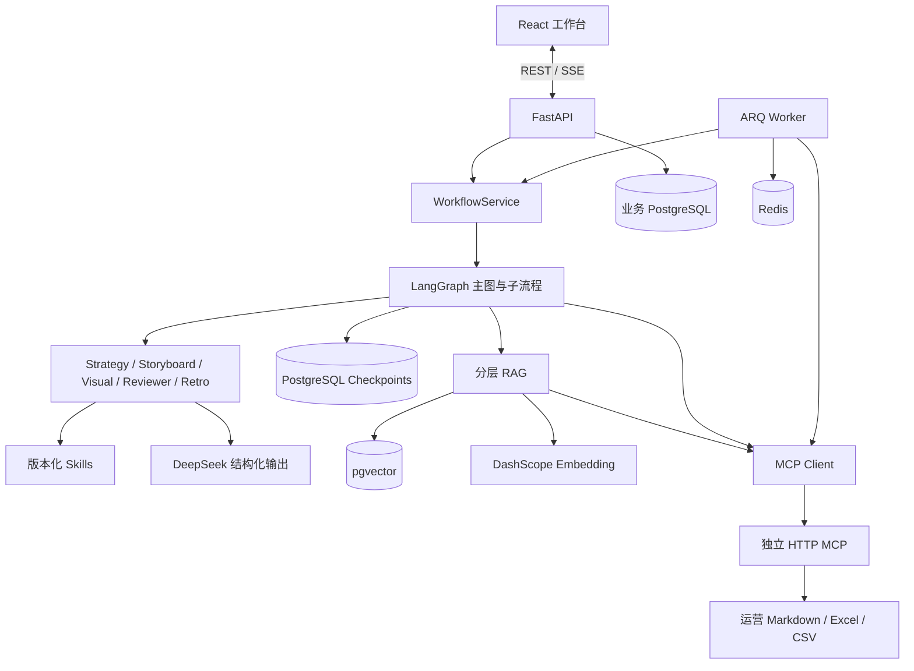

# 系统架构

[项目首页](../README.md) · [业务图集](business-workflow.md) · [代码导览](learning-guide.md)

## 进程与职责

React、API、Worker 和 MCP 是四类进程。API 和 Worker 分别构建自己的服务容器，访问共同的数据库和运营数据源。当前 Docker Compose 只启动 PostgreSQL/pgvector 与 Redis，其余进程由主机脚本启动。

## 工作流与人工控制

1. 读取运营上下文：周复盘、单篇记录、长期打法与精确指标，为 Strategy Agent 提供证据。
2. 生成三个选题后暂停，等待人工选择、自定义或重生成。
3. Storyboard Agent 输出分镜，Reviewer 返回审核意见；Graph 最多自动返工两轮，再交给人工编辑确认。
4. Visual Agent 根据已批准分镜生成 Prompt 包，之后直接进入人工确认；当前没有连接视觉输出 Reviewer 节点。
5. 生成发布前预测，等待创作者在外部完成发布并登记信息。
6. 等待运营指标达到 24h/48h，再生成复盘与知识提案；人工批准后执行受控写回。

人工选择与指标等待都使用显式状态和暂停点。当前主流程包含选题、分镜、Prompt、发布、指标、知识审批六类 `interrupt()` 调用，不把它们隐藏在单轮模型对话中。

## Agent 和确定性代码的分工

| 语言推理任务 | 确定性任务 |
| --- | --- |
| 选题角度、冲突与叙事机制 | 资料读取、检索和指标匹配 |
| 分镜设计与内容审核意见 | Schema 校验、状态路由与返工上限 |
| 封面及逐格视觉描述 | 版本记录、checkpoint 和产物入库 |
| 预测依据、复盘解释、知识提案 | 人工批准校验、路径限制与幂等写回 |

Agent 不能自行跳过审批，也不直接接触任意文件写权限。模型评分是辅助判断，不作为经过校准的业务概率。

## 状态与版本

- `AgentState` 保存 JSON 友好的业务状态；Checkpointer 持久化图执行快照。
- 人工恢复通过 `Command(resume=...)` 传递决定。恢复时，包含 interrupt 的节点会重新执行到暂停位置，因此暂停前的副作用需要具备重放安全性。
- `skill_plan` 在运行初始化时冻结各 Skill 版本，重生成和 Fork 继承该计划。Skill 指令、Prompt 与规则的 hash 记录用于追溯，不保证模型再次生成完全相同的文本。
- 产物按项目分配新版本，避免分支继承旧状态时覆盖已有版本。
- Fork 读取选定 checkpoint 的状态，应用用户修改，创建新 thread 并继续后续流程；旧 checkpoint 不被覆盖，项目活动路线切换到新 thread。

实现：[状态](../backend/app/domain/state.py)、[工作流服务](../backend/app/graphs/service.py)、[版本化仓储](../backend/app/repositories/postgres.py)、[SkillRegistry](../backend/app/skills/registry.py)。

## RAG 与精确指标分离

Markdown 经验资料按标题和长度切块，通过 pgvector 余弦相似度取得语义候选，同时在应用层计算词法匹配候选，合并后结合来源和时效排序。近期周复盘的来源权重高于单篇记录与长期打法，但最终排序也受相关性影响。

当前实现不是 PostgreSQL FTS / BM25；接口中的 `retrieval_mode="fulltext"` 是历史命名，实际表示应用层词法降级检索。向量路径失败时返回 `retrieval_degraded=true`，而不是假装仍使用语义检索。重排权重目前是启发式配置，尚无标注集证明其最优。

阅读量、分享数和小时曲线不靠向量相似度回答，而是经 MCP Tool 精确读取和计算。

实现：[切块](../backend/app/rag/documents.py)、[混合检索](../backend/app/rag/hybrid.py)、[指标同步](../backend/app/domain/metrics.py)。

## 事件与异步任务

节点事件先写仓储，再广播到当前进程的订阅队列。SSE 订阅会先读取历史事件，然后接收实时事件，工作台据此展示处理阶段。

ARQ 每小时检查等待指标的作品，匹配发布记录并保存指标快照；达到相应里程碑后恢复工作流。数据来源是已有运营系统维护的文件，不是本项目直接抓取微信后台。

## 写回边界

写回依次经过人工决定、Graph 确定性节点、后端私密批准令牌、MCP 路径白名单与幂等记录。允许的文件类型包括：

- `drafts/<id>/article_record.md`
- `<周期>/weekly_review.md`
- `knowledge/content_playbook.md`

Excel/CSV 始终只读。模型输出仅作为知识提案；后端服务负责选定提案和构造工具参数，MCP 适配器执行路径与批准校验。

实现：[ApprovedWritebackService](../backend/app/domain/writeback.py)、[MCP Adapter](../mcp_server/app/adapters/wechat_workspace.py)。

## 运行边界

当前实现面向单用户本地运营，不能把已有机制扩大解释成生产级保证：

- API 使用进程内后台任务驱动 Graph；checkpoint 持久化不等于任务在进程退出后必然自动继续。
- SSE 实时订阅队列是进程内的，API 与 Worker 之间没有共享事件总线，也不保证跨进程实时推送或无缝、无重复的游标回放。
- 指标快照和写回有去重机制，但调度、文件写入和数据库状态不是统一事务，不宣称端到端 exactly-once。
- 批准令牌用于限制工具写回，不等同于用户身份认证；目前没有登录、多租户隔离、公网访问控制。
- 视觉 Prompt 输出规则函数已存在，但尚未接入主图输出校验；当前靠结构化解析与人工确认，不宣称逐字对白、角色一致性和裁切全部得到强制保证。
- 自动化测试覆盖确定性逻辑和工作流契约；真实模型内容质量、预测校准和线上可靠性需要独立评测。

后续公网部署应先补齐身份权限、持久任务调度、共享事件总线、运行恢复策略、监控告警与数据备份，再讨论开放访问。
