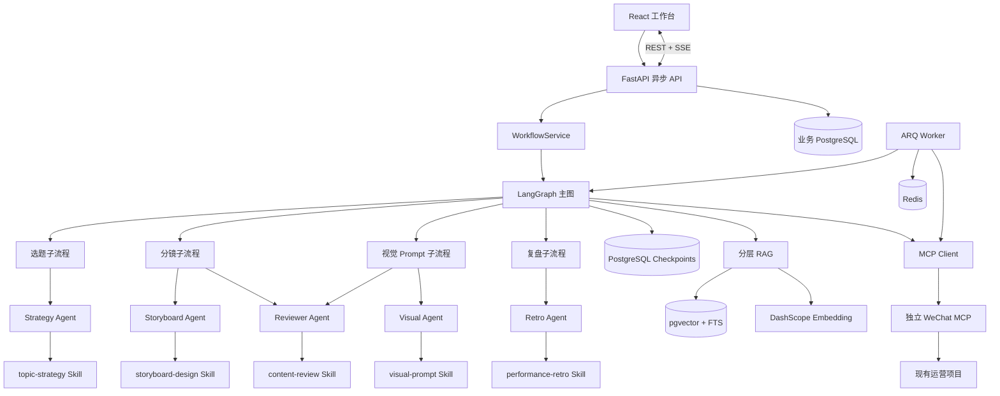
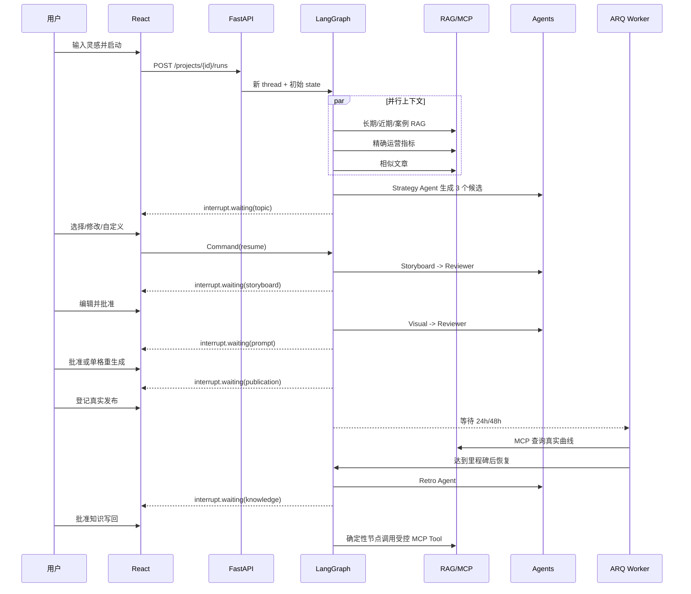

# 架构说明

## 从大到小的嵌套关系

最外层是“产品”：前端、API、Worker 和 MCP 四个进程。API 内部包含工作流服务；工作流服务编译一张 LangGraph；Graph 的模型节点调用五个 Agent；每个 Agent 只加载自己的版本化 Skill。RAG 和 MCP 是 Graph 的工具层，不是 Agent。

## 一次创作如何串起来

## Agent 与确定性节点的边界

| 需要语言推理 | 确定性代码 |
|---|---|
| 三个选题的角度与叙事机制 | Excel/CSV 读取、指标计算 |
| 6–10 格故事设计 | Schema 和连续序号校验 |
| 英文视觉 Prompt | 路径白名单与幂等键 |
| 内容审核意见 | interrupt 判断、路由、重试次数 |
| 复盘解释和知识提案 | checkpoint、fork、批准后写回 |

设计原则：不是所有步骤都做成 Agent。可以稳定验证的工作使用普通代码，降低幻觉和成本。

## 状态、checkpoint 与时间回溯

`AgentState` 只保存 JSON 友好值。每个节点结束后 Checkpointer 保存状态和下一节点。历史产物带版本号；Skill 运行带 `skill_name/version/prompt_hash`。

Fork 的逻辑是：读取旧 `checkpoint_id` 的 `values + next`，复制为新 `thread_id`，应用用户 `state_patch`，从旧 `next` 继续。旧 thread 不修改，因此可以并排比较两条路线。

## RAG 与精确指标为什么分开

文章复盘、打法和叙事机制适合相似检索，所以进入 pgvector + 全文检索。阅读量、分享数和小时曲线必须精确，直接通过 MCP Tool 查询。把数字做向量相似度会丢失精确含义。

重排分数由语义、全文、来源等级和时效共同组成。Embedding 报错时，服务返回 `retrieval_degraded=true` 并改走全文检索，前端显示黄色提示。

## 写回安全

完整链路有四层门：前端人工批准、Graph 确定性审批节点、后端私密批准令牌、MCP 路径白名单与幂等存储。允许的目标只有：

- `drafts/<id>/article_record.md`
- `<周期>/weekly_review.md`
- `knowledge/content_playbook.md`

原始 Excel/CSV 没有任何写工具。
