# 业务流程与运行图集

[返回项目首页](../README.md)

这些截图来自 2026-08-28 的实际运行，覆盖不同作品和历史版本。按业务顺序整理，方便直接浏览，不要求启动项目。点击图片可查看原图。

[作品管理](#作品管理) · [选题决策](#选题决策) · [分镜编辑](#分镜编辑) · [视觉交付](#视觉交付) · [发布登记](#发布登记) · [运营数据](#运营数据) · [调用追踪](#调用追踪) · [历史分支](#历史分支)

## 作品管理

每个作品维护自己的灵感、运行状态和当前工作流，便于区分待审批与待发布的内容。

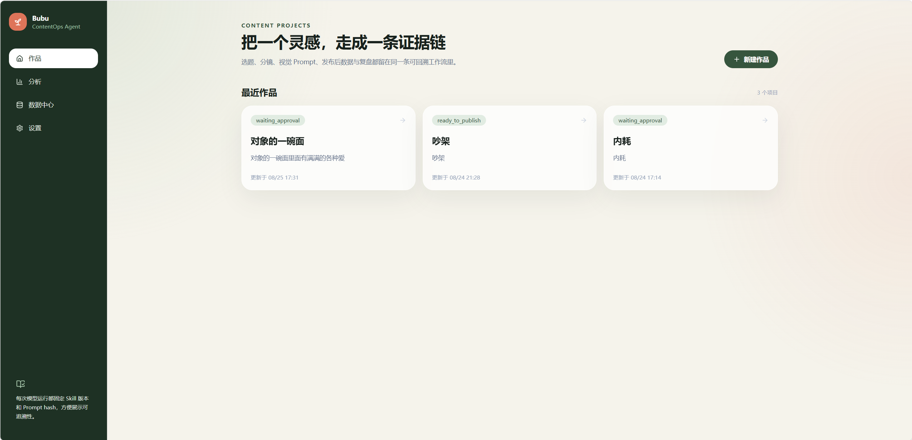

创建作品时输入名称、目标读者和灵感，不必先写完整脚本。截图中不同作品的状态独立显示，其中也保留了失败状态；这组图片不代表所有作品都已完成全流程。

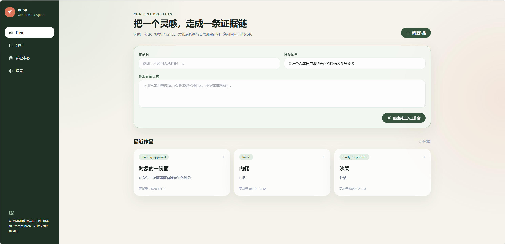

## 选题决策

系统生成三个候选方向，分别解释冲突、叙事机制与读者价值。创作者可以选一个继续、重做三个方向，或采用自定义选题。

右侧引用长期打法、近期周复盘等资料。候选评分是模型判断，引用侧栏的数字是检索排序信息，两者都不应理解为概率或业务效果承诺。

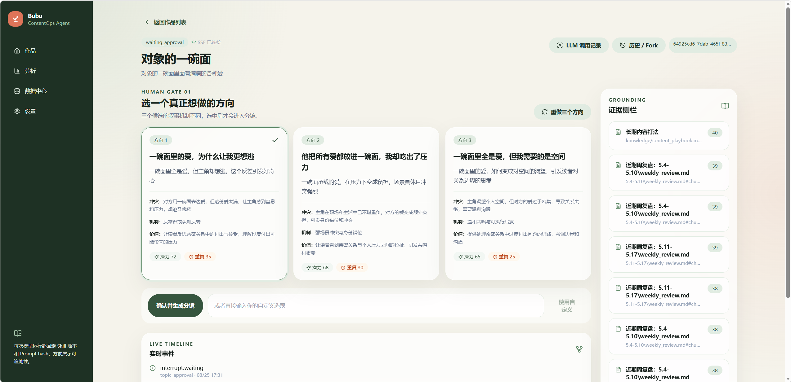

对应实现：[TopicApproval](../frontend/src/features/topics/TopicApproval.tsx)、[Strategy Agent](../backend/app/agents/strategy.py)、[RAG](../backend/app/rag/hybrid.py)。

## 分镜编辑

选题确认后，故事拆成结构化分镜。交接卡保存时间、环境、叙事机制、固定道具和情绪高点；每格可以修改场景、动作、对白和镜头，保存后再进入视觉生成。

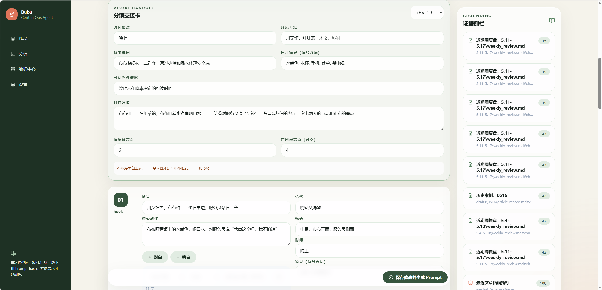

查看旧分镜的交接字段补全提示

旧版本记录缺少交接卡时，系统从已有分镜补全可推导字段，并提示人工核对。截图中的“由旧版分镜生成交接卡”不表示这些字段已经由人确认。

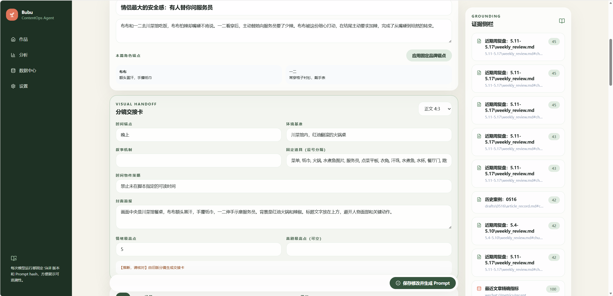

对应实现：[StoryboardApproval](../frontend/src/features/storyboard/StoryboardApproval.tsx)、[分镜交接与输入校验](../backend/app/domain/visual_rules.py)。

## 视觉交付

提交分镜后，页面展示当前处理阶段和节点事件，区分“正在生成”与“等待人工决定”。

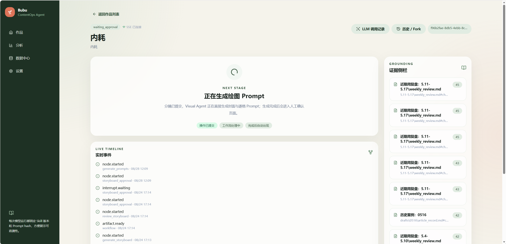

完成后，封面及逐格 Prompt 可以复制到外部绘图工具。Prompt 包包含画面描述、负面约束和连续性说明，支持只重做选定格。

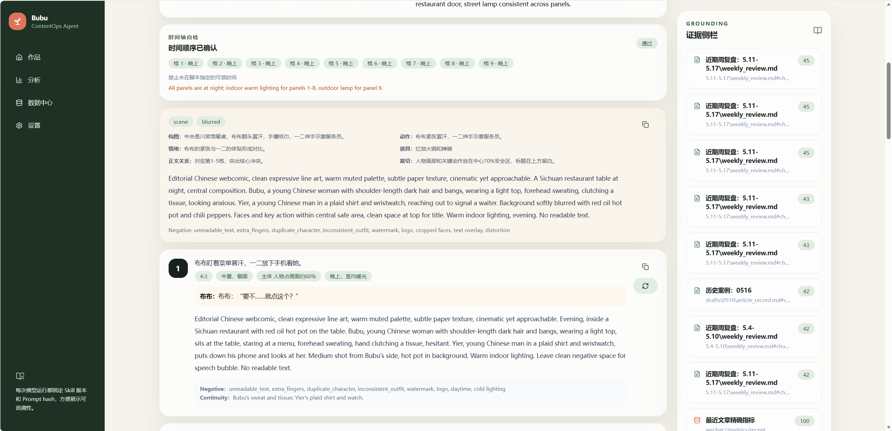

这张结果图来自 `visual-prompt v1.0.0` 历史运行，不用于证明 v1.1 的品牌角色、精确对白或裁切规则已经全部通过校验。历史运行保留自己的版本，具体边界见[版本说明](visual-prompt-v1.1.md)。

对应实现：[PromptApproval](../frontend/src/features/prompts/PromptApproval.tsx)、[Visual Agent](../backend/app/agents/visual.py)。

## 发布登记

创作者在外部完成绘图与公众号发布，再登记最终标题、发布时间，以及可选文章 ID/链接。此页面是发布信息登记，不会自动发布公众号，也不表示截图中的文章已经发布成功。

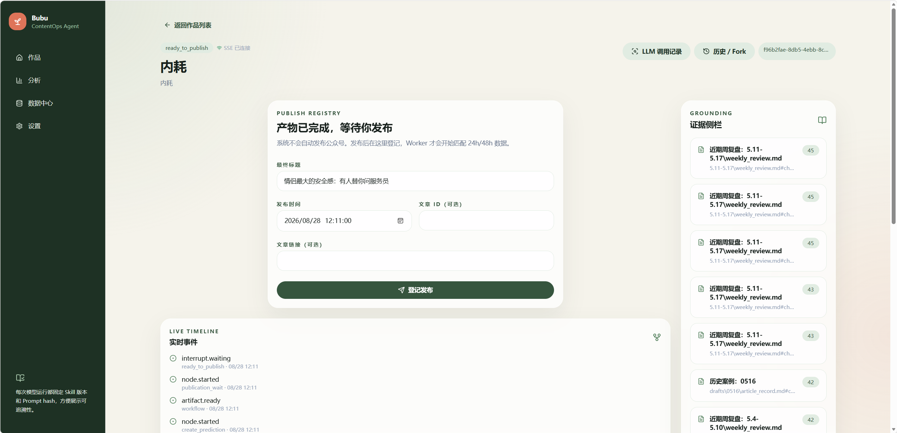

登记信息用于后续匹配运营记录。没有文章 ID 时，按标题和时间窗口匹配；无法唯一匹配时不能直接把某篇文章的数据归到当前作品。

对应实现：[PublicationGate](../frontend/src/features/approval/PublicationGate.tsx)、[指标匹配与同步](../backend/app/domain/metrics.py)。

## 运营数据

数据中心只读展示已有运营系统提供的 Excel 数据，包括作品阅读表现、互动指标、历史基线和采集状态。截图中保留“数据可能延迟”和“缓存快照”提示，帮助区分新鲜数据与历史快照。

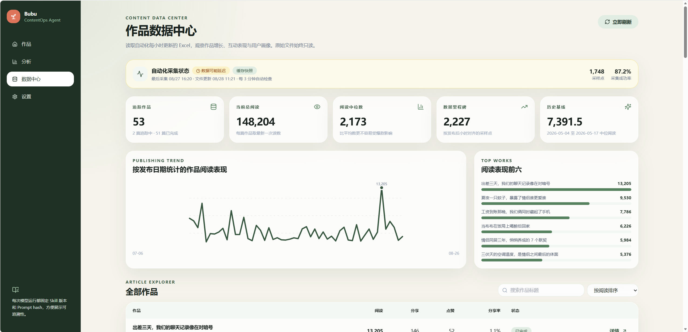

图中的阅读量、采集成功率等均为当时业务数据，不能当作 Agent 的增量效果或服务可用性指标。页面定时刷新与 Worker 的每小时里程碑检查是不同任务；本仓库不负责直接抓取公众号后台。

后续链路由代码实现：同步到 24h/48h 指标后恢复复盘，生成知识提案，经人工批准再限定路径写回。本组截图未包含复盘审批和成功写回画面，不将数据中心图片当作这两步的运行证据。

对应实现：[DataCenterPage](../frontend/src/pages/DataCenterPage.tsx)、[ContentDataService](../backend/app/domain/content_data.py)、[Worker](../backend/app/workers/tasks.py)、[知识审批](../frontend/src/features/approval/KnowledgeGate.tsx)。

## 调用追踪

可以按节点检查实际发给模型的消息、输入 JSON、原始输出、解析结果、错误、耗时、Skill 版本与 Prompt hash。它用于定位“问题来自输入、提示词、模型输出还是 Schema”，也为后续评测积累材料。

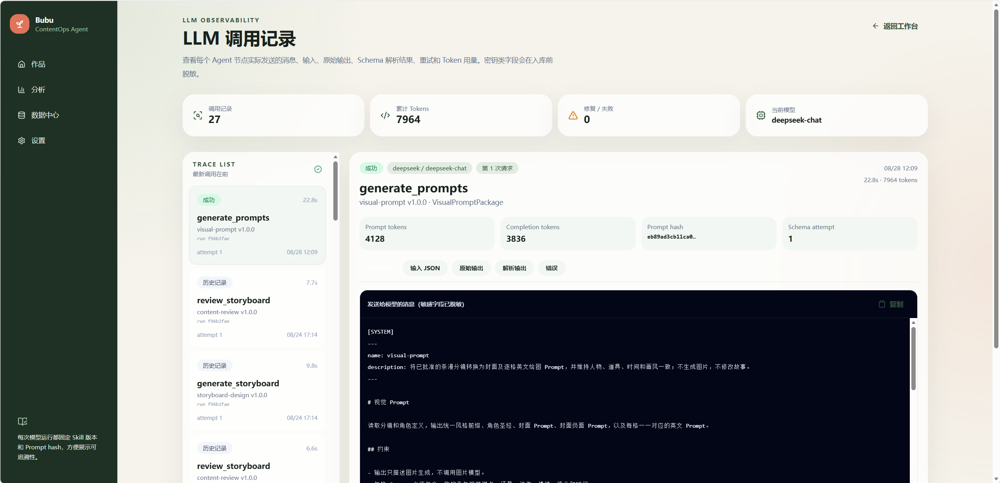

截图中 `visual-prompt v1.0.0` 表示旧运行继续使用冻结版本。标为“历史记录”的调用产生于完整 Trace 功能之前，可能缺少消息和 Token 用量；累计 Token 只汇总已有记录，不代表完整历史成本。

对应实现：[LlmTracesPage](../frontend/src/pages/LlmTracesPage.tsx)、[模型调用与记录](../backend/app/integrations/llm.py)、[SkillRegistry](../backend/app/skills/registry.py)。

## 历史分支

当创作者想尝试另一条路线时，可以从历史 checkpoint 创建新 thread，保留旧路线的状态记录。新分支继续处理后续节点，作品的活动运行指向新 thread。

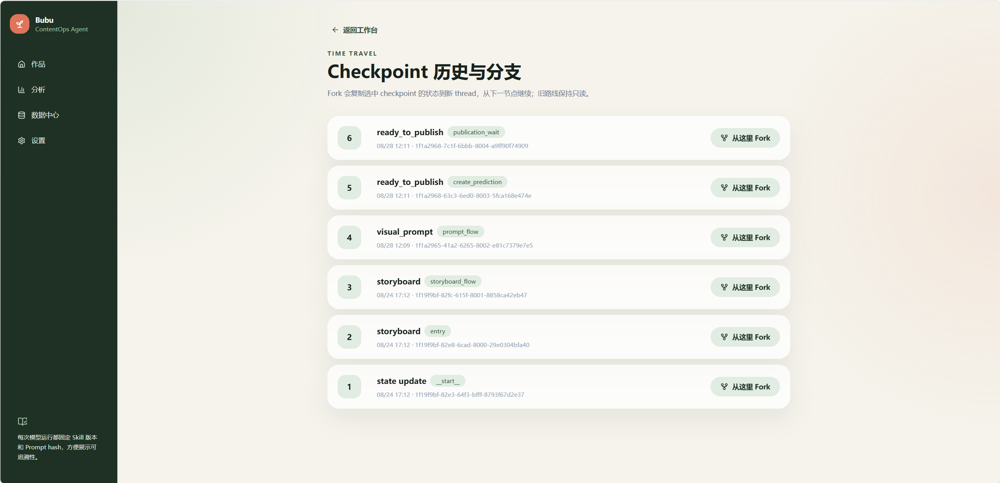

这个页面展示历史记录和分支入口，不把“能创建分支”等同于自动对比质量或自动选出更优路线。

对应实现：[HistoryPage](../frontend/src/pages/HistoryPage.tsx)、[WorkflowService.fork](../backend/app/graphs/service.py)。

---

全部 11 张原始截图以语义化文件名存放于 [assets/screenshots/](assets/screenshots/)，未裁切、合成或改写界面数据。运行数据快照与当前代码能力应结合版本说明分别理解。
